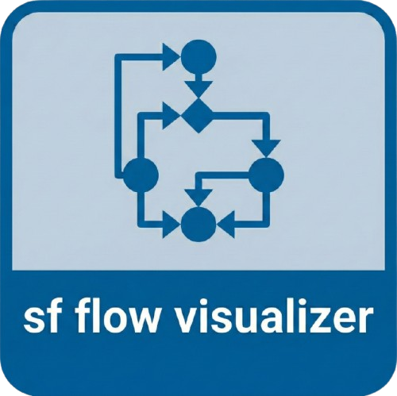

<p align="center">
  
</p>

<h1 align="center">SF Flow Visualizer</h1>

<p align="center">
  <strong>Visualize Salesforce Flow XML files with an interactive diagram in VS Code</strong>
</p>

<p align="center">
  <a href="https://github.com/Avinava/vscode-sf-flow-visualiser/releases">
    
  </a>
  <a href="https://github.com/Avinava/vscode-sf-flow-visualiser/blob/master/LICENSE">
    
  </a>
</p>

---

## ✨ Features

- 🎨 **Interactive Flow Diagram** - Beautiful, modern visualization of your Salesforce Flows
- 🔍 **Node Details Panel** - Click any node to view its properties, connections, and raw XML
- 🔄 **Smart Auto-Layout** - Intelligent tree-based layout with proper branch and merge handling
- 🖱️ **Smooth Navigation** - Pan with drag, zoom with scroll, and reset with one click
- 📁 **Multiple Access Points** - Editor title bar, context menu, explorer, and command palette
- 🎯 **Branch Visualization** - Clear representation of decision branches, loops, and fault paths
- ⚡ **Fault Path Tracking** - Red dashed connectors clearly show error handling paths

## 📋 Supported Flow Elements

| Element | Type | Description |
|---------|------|-------------|
| ▶️ Start | Trigger | Record-triggered, Scheduled, or Auto-launched |
| 🖥️ Screen | UI | User interaction screens |
| 🔀 Decision | Logic | Branching with multiple outcomes |
| ✅ Assignment | Data | Variable assignments |
| 🔁 Loop | Iteration | For-each loops with next/end paths |
| ➕ Record Create | DML | Create new records |
| ✏️ Record Update | DML | Update existing records |
| 🔍 Record Lookup | Query | Get records from database |
| 🗑️ Record Delete | DML | Delete records |
| ⚡ Action | Invocable | Apex actions and quick actions |
| 📦 Subflow | Flow | Call another flow |
| ⏰ Wait | Pause | Wait events and scheduled paths |
| ⚠️ Custom Error | Error | Custom error handling |

## 🚀 Installation

### From VS Code Marketplace

1. Open VS Code
2. Go to Extensions (`Cmd+Shift+X` / `Ctrl+Shift+X`)
3. Search for "SF Flow Visualizer"
4. Click **Install**

### From VSIX File

1. Download the `.vsix` file from [Releases](https://github.com/Avinava/vscode-sf-flow-visualiser/releases)
2. In VS Code, open Command Palette (`Cmd+Shift+P` / `Ctrl+Shift+P`)
3. Run `Extensions: Install from VSIX...`
4. Select the downloaded file

### From Source

```bash
# Clone the repository
git clone https://github.com/Avinava/vscode-sf-flow-visualiser.git
cd vscode-sf-flow-visualiser

# Install dependencies
npm run install:all

# Build the extension
npm run build

# Package the extension
npm run package
```

## 📖 Usage

### Opening a Flow

**From Editor:**
1. Open any `.flow-meta.xml` file
2. Click the **graph icon** (📊) in the editor title bar

**From Explorer:**
1. Right-click any `.flow-meta.xml` file
2. Select **"SFFV: Visualize Flow"**

**From Command Palette:**
1. Open a flow file
2. Press `Cmd+Shift+P` / `Ctrl+Shift+P`
3. Run **"SFFV: Visualize Flow"**

### Navigation Controls

| Action | Control |
|--------|---------|
| **Pan** | Click and drag on canvas |
| **Zoom In/Out** | Scroll wheel or toolbar buttons |
| **Reset View** | Click home icon (🏠) in toolbar |
| **Toggle Auto-Layout** | Click layout button in toolbar |
| **View Node Details** | Click on any node |
| **Toggle Sidebar** | Click arrow on left edge |

### Understanding the Diagram

- **Solid gray lines**: Normal flow paths
- **Red dashed lines**: Fault/error handling paths
- **Branch labels**: Show decision outcomes (e.g., "Match Found", "Default")
- **Loop connectors**: "For Each" (into loop) and "After Last" (exit loop)

## ⚙️ Configuration

| Setting | Default | Description |
|---------|---------|-------------|
| `sf-flow-visualizer.autoLayout` | `true` | Automatically arrange nodes for optimal visibility |
| `sf-flow-visualizer.theme` | `light` | Color theme: `light`, `dark`, or `auto` |

## 🛠️ Development

### Prerequisites

- Node.js 18+
- VS Code 1.85+

### Setup

```bash
# Install all dependencies
npm run install:all

# Watch for extension changes
npm run watch

# In another terminal, start webview dev server
npm run dev:webview
```

### Building

```bash
# Build everything
npm run build

# Package as VSIX
npm run package
```

### Project Structure

```
vscode-sf-flow-visualiser/
├── src/                    # Extension source code
│   ├── extension.ts        # Extension entry point
│   ├── panels/
│   │   └── FlowPanel.ts    # Webview panel manager
│   └── utilities/          # Helper functions
├── webview-ui/             # React webview application
│   ├── src/
│   │   ├── App.tsx         # Main visualizer component
│   │   └── index.tsx       # Entry point
│   └── vite.config.ts      # Vite configuration
├── assets/                 # Extension icons
└── package.json            # Extension manifest
```

## 📝 License

MIT License - see [LICENSE](LICENSE) for details.

## 🤝 Contributing

Contributions are welcome! Please feel free to submit a Pull Request.

## 🙏 Credits

Built with:
- [React](https://reactjs.org/) - UI framework
- [Vite](https://vitejs.dev/) - Build tool
- [Tailwind CSS](https://tailwindcss.com/) - Styling
- [Lucide Icons](https://lucide.dev/) - Icons
