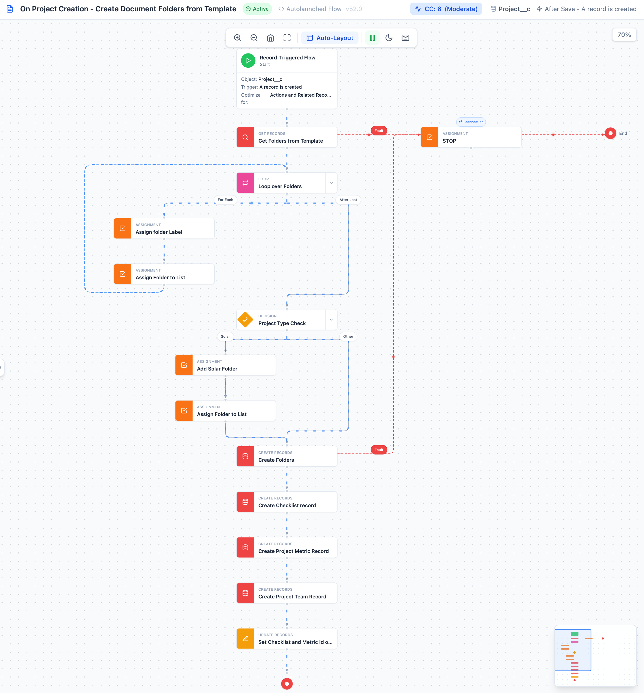

<p align="center">
  
</p>

<h1 align="center">SF Flow Visualizer</h1>

<p align="center">
  <strong>Transform Salesforce Flow XML files into beautiful, interactive diagrams</strong>
</p>

<p align="center">
  <a href="https://marketplace.visualstudio.com/items?itemName=avidev9.sf-flow-visualizer">
    
  </a>
  <a href="https://marketplace.visualstudio.com/items?itemName=avidev9.sf-flow-visualizer">
    
  </a>
  <a href="https://marketplace.visualstudio.com/items?itemName=avidev9.sf-flow-visualizer">
    
  </a>
  <a href="https://github.com/Avinava/vscode-sf-flow-visualiser/blob/master/LICENSE">
    
  </a>
</p>

---

## 🖼️ Preview

<p align="center">
  
</p>

<p align="center">
  <em>Visualize complex Salesforce Flows with an intuitive, modern interface</em>
</p>

---

## ✨ Why SF Flow Visualizer?

Working with Salesforce Flows in XML format can be challenging. This extension brings your flows to life with an interactive, visual representation that makes understanding and debugging flows effortless.

### Key Features

- 🎨 **Interactive Flow Diagram** - Beautiful, modern visualization of your Salesforce Flows with color-coded elements
- 🔍 **Detailed Node Inspector** - Click any node to view its properties, connections, and raw XML in a convenient sidebar
- 🔄 **Smart Auto-Layout** - Intelligent tree-based layout algorithm that handles complex flows, branches, and merges
- 🖱️ **Smooth Navigation** - Pan with drag, zoom with scroll wheel, and reset view with one click
- 📁 **Multiple Access Points** - Open from editor title bar, context menu, explorer, or command palette
- 🎯 **Branch Visualization** - Clear representation of decision outcomes, loop iterations, and fault paths
- ⚡ **Fault Path Tracking** - Red dashed connectors clearly show error handling and fault paths
- ✨ **Animated Flow Lines** - Optional flowing animation on connectors to visualize flow direction
- 🚀 **Zero Configuration** - Works out of the box with any Salesforce Flow XML file
- 🎭 **Theme Support** - Light, dark, and auto themes to match your VS Code setup
- 💾 **Persistent Preferences** - Theme and animation settings are remembered across sessions

### What's New in 1.1.2

- Loop connectors keep their animated “flow bead” perfectly aligned with For-Each branch entries for a grounded feel
- Loop branch lines now route horizontally before dropping, removing the mid-air kink on branch transitions
- Fault connectors stay horizontal longer, so short fault hops render as crisp straight shots off the right edge of a node

## 📋 Supported Flow Elements

| Element | Type | Description |
|---------|------|-------------|
| ▶️ Start | Trigger | Record-triggered, Scheduled, or Auto-launched |
| 🖥️ Screen | UI | User interaction screens |
| 🔀 Decision | Logic | Branching with multiple outcomes |
| ✅ Assignment | Data | Variable assignments |
| 🔁 Loop | Iteration | For-each loops with next/end paths |
| ➕ Record Create | DML | Create new records |
| ✏️ Record Update | DML | Update existing records |
| 🔍 Record Lookup | Query | Get records from database |
| 🗑️ Record Delete | DML | Delete records |
| ⚡ Action | Invocable | Apex actions and quick actions |
| 📦 Subflow | Flow | Call another flow |
| ⏰ Wait | Pause | Wait events and scheduled paths |
| ⚠️ Custom Error | Error | Custom error handling |

## 🚀 Quick Start

### Installation

1. Open **VS Code**
2. Press `Cmd+Shift+X` (Mac) or `Ctrl+Shift+X` (Windows/Linux)
3. Search for **"SF Flow Visualizer"**
4. Click **Install**

Or [install directly from the marketplace](https://marketplace.visualstudio.com/items?itemName=avidev9.sf-flow-visualizer)

### First Use

1. Open any `.flow-meta.xml` file in your Salesforce project
2. Click the **graph icon** (📊) in the editor title bar
3. Explore your flow visually!

## 📖 Usage

### Opening a Flow

**From Editor:**
1. Open any `.flow-meta.xml` file
2. Click the **graph icon** (📊) in the editor title bar

**From Explorer:**
1. Right-click any `.flow-meta.xml` file
2. Select **"SFFV: Visualize Flow"**

**From Command Palette:**
1. Open a flow file
2. Press `Cmd+Shift+P` / `Ctrl+Shift+P`
3. Run **"SFFV: Visualize Flow"**

### Navigation Controls

| Action | Control |
|--------|--------|
| **Pan** | Click and drag on canvas |
| **Zoom In/Out** | Scroll wheel or toolbar buttons |
| **Reset View** | Click home icon (🏠) in toolbar |
| **Fit to View** | Click fit icon or press `F` |
| **Toggle Auto-Layout** | Click layout button in toolbar |
| **Toggle Animation** | Click animation button or press `A` |
| **Toggle Theme** | Click theme button or press `T` |
| **View Node Details** | Click on any node |
| **Toggle Sidebar** | Click arrow on left edge |

### Understanding the Diagram

- **Solid gray lines**: Normal flow paths
- **Red dashed lines**: Fault/error handling paths
- **Branch labels**: Show decision outcomes (e.g., "Match Found", "Default")
- **Loop connectors**: "For Each" (into loop) and "After Last" (exit loop)

## ⚙️ Extension Settings

This extension provides the following configurable settings:

| Setting | Default | Description |
|---------|---------|-------------|
| `sf-flow-visualizer.autoLayout` | `true` | Automatically arrange nodes for optimal visibility when coordinates are missing |
| `sf-flow-visualizer.theme` | `light` | Visual theme: `light`, `dark`, or `auto` (follows VS Code theme) |

Access settings via `Preferences > Settings` and search for "SF Flow Visualizer".

## 💡 Tips & Tricks

- **Keyboard Navigation**: Use your mouse wheel to zoom in/out for better focus on specific flow sections
- **Node Details**: Click on any node to see its full configuration, including formulas and filters
- **Branch Analysis**: Follow the color-coded paths to understand decision logic and loop iterations
- **Error Handling**: Red dashed lines show fault paths - perfect for reviewing error handling logic
- **Performance**: Large flows are handled efficiently with optimized rendering

## 🐛 Troubleshooting

**Flow doesn't display?**
- Ensure the file has a `.flow-meta.xml` extension
- Check that the XML is valid Salesforce Flow metadata

**Layout looks odd?**
- Try clicking the "Auto-Layout" button in the toolbar
- Reset the view with the home icon (🏠)

**Still having issues?**
- [Open an issue on GitHub](https://github.com/Avinava/vscode-sf-flow-visualiser/issues)

## 🗺️ Roadmap

- [ ] Export flow diagrams as images (PNG/SVG)
- [ ] Search and filter nodes within flows
- [ ] Flow comparison view (diff two versions)
- [ ] Integration with Salesforce CLI for live flows
- [ ] Flow metrics and complexity analysis

## 🤝 Contributing

Contributions, issues, and feature requests are welcome! Feel free to check the [issues page](https://github.com/Avinava/vscode-sf-flow-visualiser/issues).

### Development Setup

```bash
# Clone the repository
git clone https://github.com/Avinava/vscode-sf-flow-visualiser.git
cd vscode-sf-flow-visualiser

# Install dependencies
npm run install:all

# Start development
npm run watch              # Terminal 1: Watch extension
npm run dev:webview        # Terminal 2: Dev server

# Build and package
npm run build
npm run package
```

## 📝 License

MIT License - see [LICENSE](LICENSE) for details.

## ⭐ Show Your Support

If this extension helps you work with Salesforce Flows more efficiently, please:
- ⭐ Star the [GitHub repository](https://github.com/Avinava/vscode-sf-flow-visualiser)
- ✍️ Leave a [review on the marketplace](https://marketplace.visualstudio.com/items?itemName=avidev9.sf-flow-visualizer)
- 🐦 Share with your team and the Salesforce community

## 🙏 Acknowledgments

Built with modern web technologies:
- [React](https://reactjs.org/) - UI framework
- [Vite](https://vitejs.dev/) - Lightning-fast build tool
- [Tailwind CSS](https://tailwindcss.com/) - Utility-first styling
- [Lucide Icons](https://lucide.dev/) - Beautiful icon set
- [GitHub Copilot](https://github.com/features/copilot) - AI pair programmer that helped build and polish this extension

---

<p align="center">
  <strong>Made with ❤️ for the Salesforce Developer Community</strong>
</p>

<p align="center">
  <a href="https://github.com/Avinava/vscode-sf-flow-visualiser">GitHub</a> •
  <a href="https://marketplace.visualstudio.com/items?itemName=avidev9.sf-flow-visualizer">Marketplace</a> •
  <a href="https://github.com/Avinava/vscode-sf-flow-visualiser/issues">Report Bug</a> •
  <a href="https://github.com/Avinava/vscode-sf-flow-visualiser/issues">Request Feature</a>
</p>
